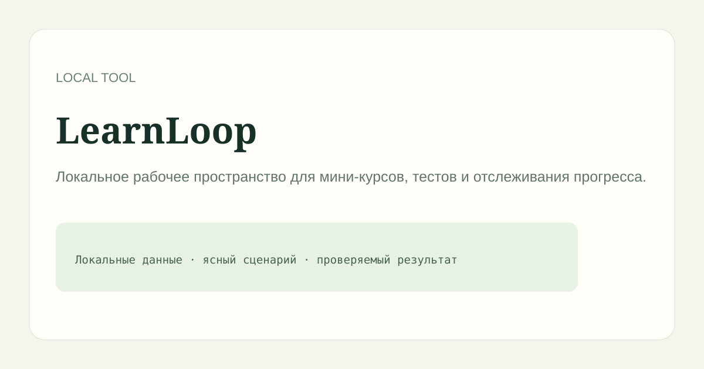

# LearnLoop

> Локальное рабочее пространство для мини-курсов, тестов и отслеживания прогресса.

## Возможности

Проект запускается локально, хранит записи в JSON-файле вне Git и не передаёт пользовательские данные наружу.

## Запуск

~~~bash
npm ci
npm start
~~~

Откройте http://localhost:3000.

## Рабочий сценарий

Создайте мини-тест, выберите ответ и сохраните попытку. Результаты можно выгрузить в CSV без внешнего аккаунта.

## Проверка

~~~bash
npm test
npm run check
~~~

## Ограничения

Это самостоятельный MVP для локальной работы. Он не заменяет серверную систему совместной работы, облачную LMS или внешний сканер сети.

## Лицензия

MIT.
